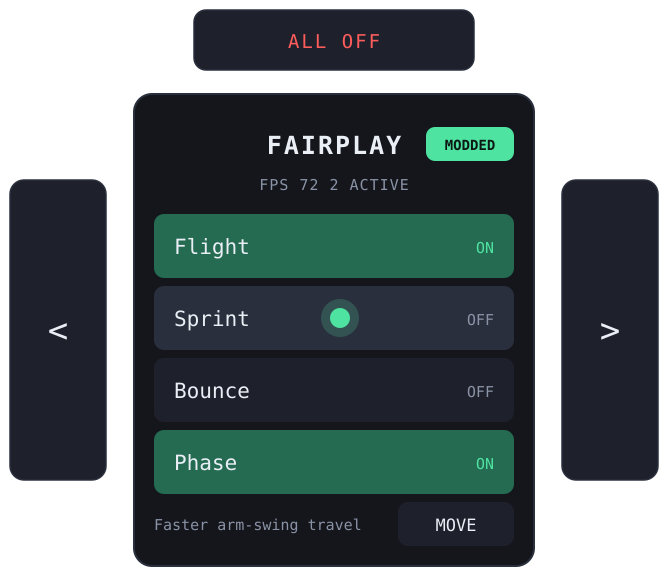
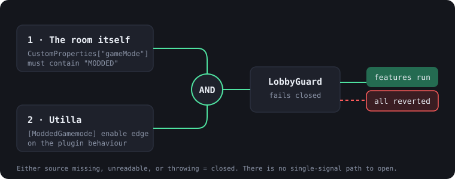

<div align="center">


# FairPlay

**A Gorilla Tag mod menu that physically cannot run in a public lobby.**

[](https://github.com/BepInEx/BepInEx)
[](https://github.com/legoandmars/Utilla)
[](#building)
[](LICENSE)



</div>

---

## The idea

Gorilla Tag ships two kinds of lobby. Vanilla queues are for everyone. **Modded** queues — Modded
Casual, Modded Infection, Modded Hunt — exist precisely so that people who install mods play with
other people who install mods.

Most mod menus treat that as a convention. FairPlay treats it as a **runtime constraint**: the
features are not merely discouraged outside a modded lobby, there is no code path that turns them on.

<div align="center"></div>

Two independent sources have to agree before a single feature can activate:

1. **The room itself.** Gorilla Tag stores the live gamemode in the Photon room's custom properties
   under `gameMode`. Modded queues carry the token `MODDED` in that string. This is read straight
   off network state, so it describes the room *everyone else in it* is also in.
2. **[Utilla](https://github.com/legoandmars/Utilla).** The `[ModdedGamemode]` attribute hands the
   plugin behaviour to Utilla, which enables it on entering a modded gamemode and disables it on
   leaving. Those two edges are the second vote.

Either source missing, unreadable, or throwing an exception closes the gate. The guard **fails
closed** — the only state that opens it is both sources actively saying yes. See
[`src/Core/LobbyGuard.cs`](src/Core/LobbyGuard.cs).

When the gate closes — you left the lobby, the room changed mode, the game threw — every module is
forced off and `Revert()` is called before any of them get another frame.

## Features

Everything below only ever touches **your own** player. Nothing sends an RPC, writes a room
property, or spawns a networked object.

| | Module | What it does | Where it lives |
|---|---|---|---|
| **Move** | Flight | Right grip thrusts along your gaze, left grip lifts, release to hover | [`FlightModule.cs`](src/Modules/FlightModule.cs) |
| | Sprint | Scales the speed your arm swings already produced, hard-capped | [`SprintModule.cs`](src/Modules/SprintModule.cs) |
| | Bounce | Multiplies the game's own jump values, restores them exactly | [`BounceModule.cs`](src/Modules/BounceModule.cs) |
| | Phase | Disables *your* body collider so geometry stops stopping you | [`PhaseModule.cs`](src/Modules/PhaseModule.cs) |
| **Build** | Platforms | Trigger drops a pad at your hand, on a budget and a timer | [`PlatformModule.cs`](src/Modules/PlatformModule.cs) |
| | Grapple | Point and pull; aim is head-to-hand, so no hand-axis guessing | [`GrappleModule.cs`](src/Modules/GrappleModule.cs) |
| | Waypoint | Save one spot, teleport back to it | [`WaypointModule.cs`](src/Modules/WaypointModule.cs) |
| **Look** | Chroma | Colour-cycles your rig, on your screen only | [`ChromaModule.cs`](src/Modules/ChromaModule.cs) |
| | Trails | Ribbons on your hands, good for reading your own swing arc | [`TrailsModule.cs`](src/Modules/TrailsModule.cs) |
| | Beacon | Light column marking your saved waypoint | [`BeaconModule.cs`](src/Modules/BeaconModule.cs) |

## Controls

The menu is a slab you **hold**: it stands up out of one hand, and you press it with the other. A
green dot marks your fingertip so you can see what you are about to hit.

| Input | Action |
|---|---|
| Free hand on a row | Hover and press. A row must be **left** before it fires again, so resting a hand on the panel cannot machine-gun a toggle |
| Holding hand `B` / `Y` | Stow or draw the slab |
| Side wings `<` `>` | Page through **MOVE / BUILD / LOOK / INFO**. They sit off the slab so a near-miss cannot hit a feature row |
| Top bar `ALL OFF` | Panic: every module off and reverted, instantly |
| `F8` | The same panic from the keyboard, for flat-screen debugging |

Two things the panel does that are worth knowing:

**It faces you, not your palm.** The slab is anchored to your hand but billboarded to your head
rather than rigidly parented to hand rotation — Gorilla Tag's hand transforms disagree between
versions about which axis points out of the palm, and billboarding is immune to that.

**It resizes itself to the page.** Pages hold different numbers of features, so the backplate grows
and shrinks and the bottom strip stays pinned under the last row. Rows never move, which means
muscle memory for the top row survives a page change.

When the gate is closed the rows stay visible, dimmed and inert, and the info line tells you exactly
why. Hiding them would be less honest about what the mod is doing.

## Does this run in the actual game?

Yes — it is a real BepInEx plugin for **Gorilla Tag on Steam (PCVR)**. It loads when the game
starts, and the panel is a real object in the scene, held in one hand and pressed with the other,
in the headset.

One hard limitation, stated up front: **standalone Quest builds cannot load this.** BepInEx patches
a Mono/IL2CPP game at launch on desktop; the Quest store build has no equivalent hook. Every
Gorilla Tag mod, this one included, is PCVR-only. Play on Steam, in a modded queue, and it works —
including when you play with Quest users over Link/Air Link, because the mod runs on your PC.

## Install (players)

1. Install **BepInEx 5.4.x** into your Gorilla Tag folder — the usual route is
   [Monke Mod Manager](https://github.com/DeadlyKitten/MonkeModManager), which does it for you.
2. Launch the game once so BepInEx unpacks itself, then close it.
3. Install **Utilla** (Monke Mod Manager lists it; it is what adds the Modded queues to the
   in-game computer in the first place). FairPlay refuses to load without it.
4. Drop `FairPlay.dll` into `Gorilla Tag/BepInEx/plugins/FairPlay/`.
5. Launch, walk to the computer, and pick **Modded Casual** or **Modded Infection**.

Until you are in one of those queues the panel shows a red `LOCKED` pill and nothing switches on.

## Building

Requires the [.NET SDK](https://dotnet.microsoft.com/download) (6.0 or newer) and a local Gorilla
Tag install to reference — the build reads the engine and game assemblies straight out of it.

```bash
dotnet build src/FairPlay.csproj -c Release
```

The project looks for the game in this order:

1. the `GORILLA_TAG_DIR` environment variable,
2. `C:\Program Files (x86)\Steam\steamapps\common\Gorilla Tag`.

Override it per build:

```bash
dotnet build src/FairPlay.csproj -c Release -p:GorillaTagDir="D:\Games\Gorilla Tag"
```

A successful build copies `FairPlay.dll` into `BepInEx/plugins/FairPlay/` automatically. Pass
`-p:DeployToGame=false` to skip that. If the game folder or BepInEx is missing the build stops with
a message saying which, rather than emitting a broken DLL.

### Building without the game

There is a fallback for machines with no Gorilla Tag install. `stubs/` holds reference-only
assemblies — `UnityEngine`, `BepInEx` and `Utilla` — containing nothing but the exact type and
member signatures FairPlay touches. `offline/FairPlay.Offline.csproj` compiles the real sources
against those:

```bash
dotnet build offline/FairPlay.Offline.csproj -c Release
```

The stubs carry the same assembly names as the real thing, so the emitted references
(`UnityEngine`, `BepInEx`, `Utilla`) resolve against the genuine assemblies at runtime.

This is a fallback, not a substitute. It proves the code compiles; it cannot prove a single
signature assumption is correct, because the stubs encode those assumptions rather than checking
them. Build with `src/FairPlay.csproj` against a real install whenever you can — that is the only
build that can be verified.

## Configuration

Everything tunable is a BepInEx config entry, written to
`BepInEx/config/com.larprober.gorillatag.fairplay.cfg` on first run.

| Key | Default | Notes |
|---|---|---|
| `General / AllowOutsideRoom` | `true` | Lets features run while in no lobby at all, for solo testing. It cannot open the gate in a public lobby — that path does not exist |
| `Menu / MenuHand` | `Left` | Which hand holds the slab |
| `Menu / Offset` | `0, 0.03, 0.02` | Where the slab sits relative to the holding hand. Y is the gap above your hand, Z pushes it away, X slides it sideways and mirrors when you switch hands. **Nudge this first** if it clips your controller model |
| `Menu / Scale` | `1.0` | 0.6 – 1.6 |
| `Menu / PanicKey` | `F8` | Keyboard kill switch |
| `Movement / FlySpeed` | `9` | m/s |
| `Movement / SpeedMultiplier` | `1.6` | Sprint, capped at 24 m/s internally |
| `Movement / JumpMultiplier` | `1.7` | Bounce |
| `Builder / GrappleForce` | `12` | m/s pull |
| `Builder / PlatformBudget` | `12` | Oldest pad recycles past this |
| `Builder / PlatformLifetime` | `14` | Seconds; `0` disables the timer |

## Architecture

```
src/
├── Plugin.cs              BepInEx entry. Owns only the Utilla gate edges
├── Runtime.cs             Always-on heartbeat: polls the gate, ticks modules, owns the panel
├── Core/
│   ├── LobbyGuard.cs      The two-source gate. The single authority on "may anything run"
│   ├── Module.cs          Base contract: self-only, revertible, cannot throw its way out
│   ├── ModuleRegistry.cs  Holds modules, force-disables them, rejects unfair ones at load
│   └── Settings.cs        Every tunable, bound to the BepInEx config file
├── Menu/                  The held slab: theme, buttons, pages, controller
├── Modules/               One file per feature
└── Utils/
    ├── GameRefs.cs        Every touch point with Gorilla Tag's own code, by reflection
    ├── Reflect.cs         Reflection helpers that treat "renamed" as normal, not fatal
    ├── XRInput.cs         Controller state from UnityEngine.XR, sampled once per frame
    └── Draw.cs            Runtime geometry and text, no asset bundle
```

Three decisions worth explaining:

**All game access goes through reflection.** Gorilla Tag renames things between updates —
`GorillaLocomotion.Player` became `GorillaLocomotion.GTPlayer`, for one. Resolving lazily by name
means a rename degrades into "that one feature is unavailable and says so in the log", instead of a
plugin that fails to load at all. It also keeps the compile-time surface down to Unity, Photon and
BepInEx.

**The menu is built from primitives, not an asset bundle.** A bundle has to be rebuilt against the
exact Unity version the game ships. Cubes and `TextMesh` render on every version, and the entire UI
stays readable as code in this repository rather than as a binary blob.

**The plugin behaviour and the runtime loop are separate objects.** Utilla disables the plugin
behaviour outside modded lobbies. If the menu lived there it would freeze the moment the gate shut,
and could never explain itself. So `Plugin` holds nothing but the gate edges, and `Runtime` — which
always ticks — asks `ModuleRegistry` what it is allowed to do.

## What this deliberately will not do

No player highlighting or through-wall vision, nothing that moves, tags or renders another player,
no room manipulation, no name or cosmetic spoofing, and no attempt to hide that the mod is running.

Player highlighting is the interesting exclusion: it is technically self-only, which is exactly why
"self-only" alone is not a sufficient policy. The reasoning, and where each rule is enforced in
code, is in [docs/FAIR-PLAY.md](docs/FAIR-PLAY.md).

## Notes

Gorilla Tag is a third-party game; this project is not affiliated with or endorsed by Another Axiom.
Mods are supported through the game's own modded queues, and this one is built so it cannot leave
them. If a game update renames something the reflection layer looks for, the affected feature
reports it in the BepInEx console and the rest keeps working.

Licensed under [MIT](LICENSE).
